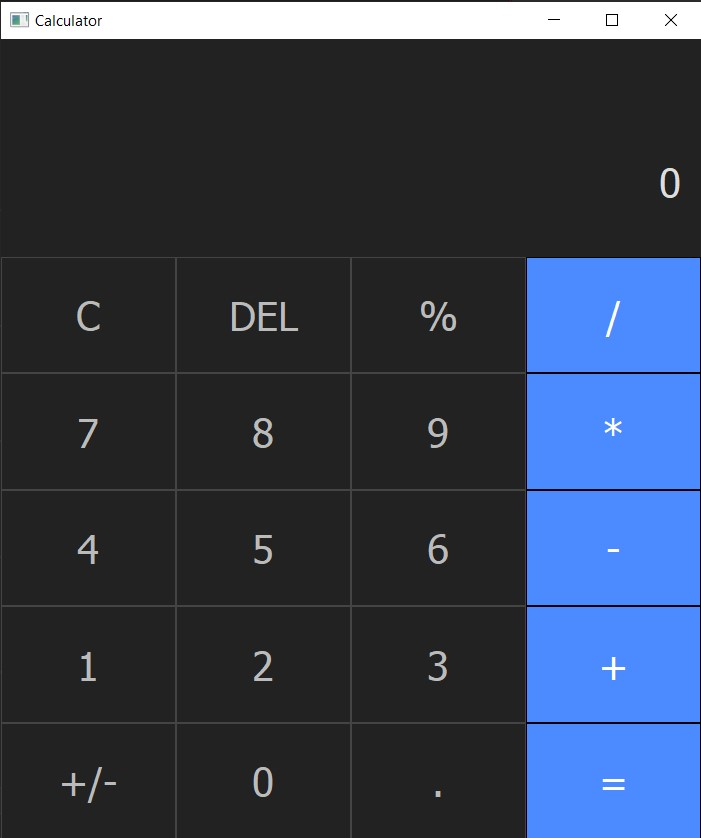
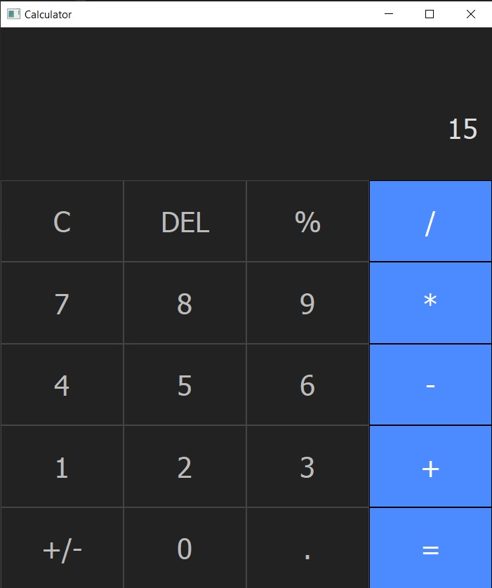
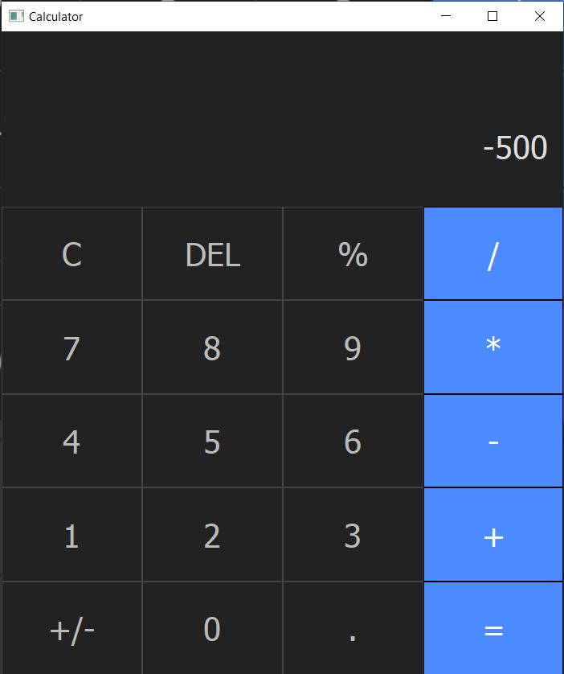
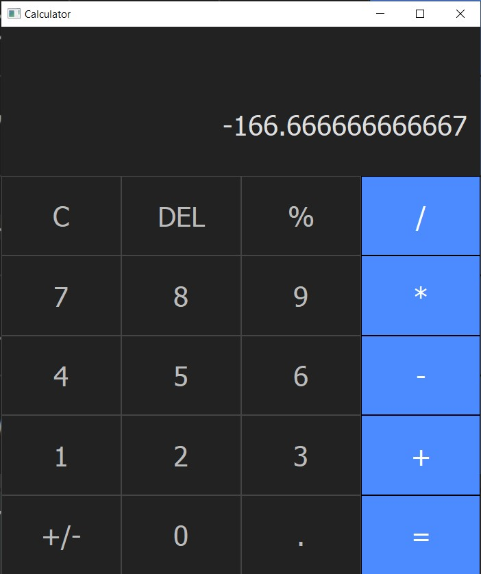

# Calculator
A calculator that will have many functions
what I need to do:
1. Add some buttons;
2. Add label to see the result;
3. Add functional to buttons;
4. Add logic for operations prioritets.
---
# Results
### The program looks like this:  

  

---

### Operator "+":  

  

  

---

### Operator "-":  

  

  

---

### Operator "*":  

  

  

---

### Operator "/":  

  

  

---

### Operator "%" (multiplies by 0.01):  

  

  

---

### Operator "+/-" (changes sign of number):  

  

  

---